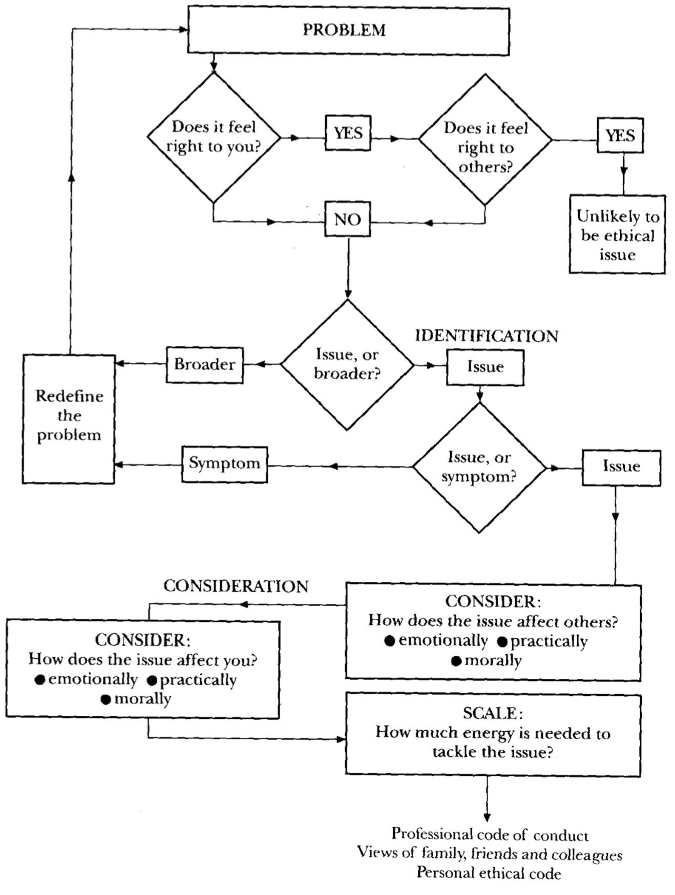

# CS22120 Lecture 11
## Ethical Issues for Computing Students (1)

"Making the right choices in difficult situations." 

**Thursday, 1st March 2018**  
Lecture: cjp@aber.ac.uk   
Notes: ela12@aber.ac.uk  

These notes are based off the course notes provided by [Prof. Chris Price](https://www.aber.ac.uk/en/cs/staff-list/staff_profiles/?staff_id=cjp).

# 

### Introduction

Ethics could be thought of as making choices with a moral dimension. As computer scientists, software engineers, developers, managers, etc., we make most of our choices without much conscious tought, even decisions with _some_ moral dimension. If this wasn't the case, our productivity would be hampered by our inability to make simple decisions. 

Some choices raise ethical issues - these choices can be identified easily. Either they don't "feel" right, or the ehtics of the choice are raised by a third party. It is imperative that in these situations that decisions aren't made with factors of conveince in mind, or derived by a "cost/benefit" analysis of the situation. 

Some very simple ethical questions, but with complex, non-trivial answers: 

- Should the state spy on all citizens to catch out criminals? 
- Should military UAV drones be developed? 

A specific example for the software industry:

"You are working on a team writing software to control a nuclear reactor: corners are being cut on the agreed/documented safety processes to save money, but if money is not saved, then people will lose their jobs. What should you do? "

### Types of Problems in Computing 

There are two main types of ethical problems in computing: general and special.    

General ethical problems are those that can be argued by anaglogy and have a "general" ethical position. For example, if you urgently needed to access someone's files and they are away and can't give you express permission to do so, should you break into their system? 

Specicalised ethical problems: these exist purely because of the advanced capability of a given technology. The previous state survelliance example falls into this category of ethical problems. 

### Process of Ethical Decision Making 

This diagram is from Practical Computer Ethics by Langford. 

### Making Ethical Decisions 

Ethical decisions should **not** be made using a cost/benefit analysis of the situation. Furthermore, ethical decisions are **not** simply a matter of deciding what is "right" and "wrong" in absolute terms. Making good decisions that can be broadly supported require a holistic view of the specific situation, incorporating: 

- Experience
- Breadth of Opinion
- Belief 
- Principles 
- Working within guidelines 
- Working within the law. 

### Applying an Ethical Code 

Clarify the situation.  
&downarrow;  
Clarify the issues.  
&downarrow;  
Awareness of your responsibilities.    
&downarrow;  
Respect the views of others.   
&downarrow;  
Consider alternative perspectives.    
&downarrow;  
Question: Are there non-technical implications to the desicion?     
&downarrow;  
Action: Take ethical responsibility. 

### Questions to Ask 

It's useful to have general principles of where you stand on certain issues, and reflect on how these opinions change over time. 

- Military work? What kind?
- Stance on privacy/security?
- Views of liberty/censorship?
- Environmental issues?
- Exploitation of others?
- Rights of workers?
- Lying, theft, murder?
- Other, more job-specific principles.
